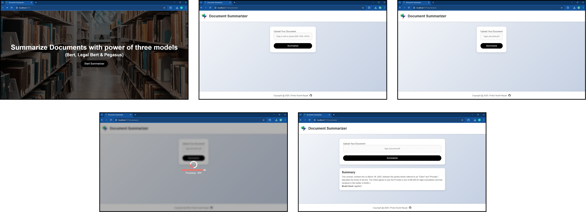

# Document Summarization API

Welcome to the **Document Summarization API**, a powerful Flask-based backend paired with a modern, lightning-fast **Vite-powered front end**. This project generates concise summaries from PDFs and images using state-of-the-art NLP models including Pegasus, BERT, and LegalBERT.

The intelligent model selection mechanism chooses the best summarizer for general or legal documents. The sleek, responsive front end enables seamless file uploads, summary customization, and results display, all built with modern JavaScript tooling.



---

## Features

- **Multi-Model Summarization**:  
  Uses Pegasus (abstractive), BERT (extractive), and LegalBERT (legal extractive) models.
- **Smart Model Selection**:  
  TF-IDF-based logic to auto-select the best summarization approach.
- **File Type Support**:  
  Accepts PDFs, PNGs, and JPEGs; extracts text with `pdfplumber` and `pytesseract`.
- **Customizable Summaries**:  
  Choose between _normal_ or _long_ summary lengths for Pegasus.
- **Fine-Tuning Ready**:  
  Supports training on CNN/DailyMail and BillSum datasets.
- **Modern Front End**:  
  Built with Vite and [React/Vue/Vanilla JS] for fast, responsive UX.
- **RESTful API**:  
  Seamless backend integration and scalability.
- **Modular Architecture**:  
  Clean codebase for easy extension and maintenance.

---

## Prerequisites

- Python 3.8+
- Node.js 18+ and npm
- Tesseract OCR
  - **Ubuntu**: `sudo apt-get install tesseract-ocr`
  - **macOS**: `brew install tesseract`
  - **Windows**: [Tesseract at UB Mannheim](https://github.com/UB-Mannheim/tesseract/wiki)
- `requirements.txt` Python dependencies
- A modern web browser (Chrome, Firefox)

---

## Note on Datasets and Fine-Tuned Models

- **Datasets**:  
  Not included in the repo. Download and place in paths specified in `config.py`:

  - **CNN/DailyMail**: [Hugging Face](https://huggingface.co/datasets/cnn_dailymail)
  - **BillSum**: [BillSum GitHub](https://github.com/FiscalNote/BillSum)

- **Fine-Tuned Models**:  
  Folder `fine_tuned_models/` is **not** included. If missing, models are trained on first run (with datasets in place).
  > ⚠️ GPU strongly recommended for fine-tuning.

---

## Installation

### 1. Clone the Repository

```bash
git clone https://github.com/your-username/document-summarization-api.git
cd document-summarization-api
```

### 2. Set Up the Backend

```bash
# Create virtual environment
python -m venv venv
source venv/bin/activate  # Windows: venv\Scripts\activate

# Install dependencies
pip install -r requirements.txt
```

### 3. Install Tesseract OCR

Follow the instructions under Prerequisites for your platform.

### 4. Set Up the Vite Front End

```bash
cd frontend
npm install
npm run dev
```

### 5. Prepare Datasets

Download and update config.py:

```python
CNN_DAILYMAIL_PATH = "path/to/cnn_dailymail/train.csv"
BILLSUM_PATH = "path/to/billsum/us_train_data_final_OFFICIAL.jsonl" 6. Run the Application
```

### In the project root

python app.py Runs at http://0.0.0.0:5000
Make sure the Vite front end is running in a separate terminal:

```
cd frontend
npm run dev
```

🧪 Usage
🔹 Front-End Interface

- Access: http://localhost:5173

- Upload: Drag-and-drop or select a PDF/PNG/JPEG file (max 100 MB)

- Select: Summary length (normal or long)

- Result: View the summary and the model used

> Features:

- Responsive design

- Drag-and-drop support

- Real-time loading indicator

- Clear summary display with model info

<hr>

### API Endpoint

_POST /summarize_

_Request_
_Content-Type:_ multipart/form-data

_Fields:_

file: PDF, PNG, or JPEG

length (optional): normal _or_ long for Pegasus

```python
curl -X POST -F "file=@document.pdf" -F "length=normal" http://localhost:5000/summarize
```

```json
{
  "model_used": "pegasus",
  "summary": "This is a concise summary of the uploaded document."
}
```

### Project Structure

```
document-summarization-api/
├── app.py # Main Flask backend
├── config.py # Config (dataset paths, constants)
├── frontend/ # Vite-powered front end
│ ├── src/ # Source files (React/Vue/Vanilla components)
│ ├── package.json # Front-end dependencies
│ ├── vite.config.js # Vite configuration
├── models/
│ ├── model_loader.py # Load/fine-tune models
│ ├── summarizer.py # Summarization logic
├── utils/
│ ├── text_extraction.py # PDF/image text extraction
│ ├── model_selector.py # Model selection logic
├── uploads/ # Temp uploaded files (auto-created)
├── fine_tuned_models/ # Trained models (auto-created)
├── requirements.txt # Python backend dependencies
├── README.md
```

### License

This project is licensed under the MIT License. See the LICENSE file for details.

### Contact

For questions or feedback, reach out via:

GitHub Issues

Email: praful101nayak@gmail.com
